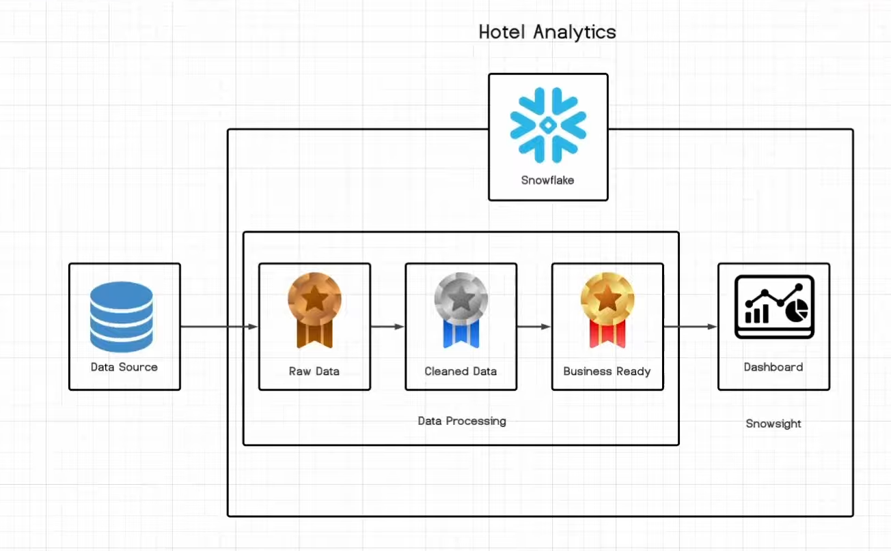
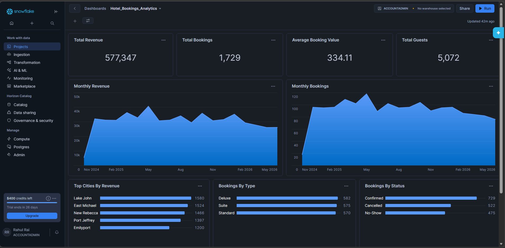

# End-to-End Hotel Booking Data Engineering Project in Snowflake

## 📊 Project Overview
This project demonstrates a complete data engineering pipeline for hotel booking analytics using Snowflake — from raw data ingestion to business-ready dashboards.

---

## 🔄 Data Pipeline
The diagram below illustrates the flow of data from source to dashboard:

---

## 📈 Final Dashboard
The final Snowflake Snowsight dashboard provides insights into revenue, bookings, and guest statistics:

